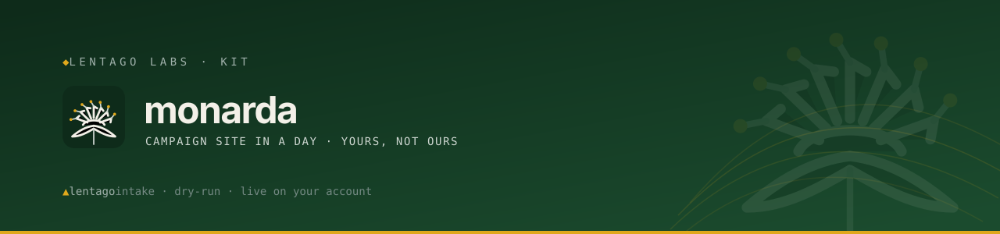

<!-- Lentago Labs brand header — generated by lentago/.github → brand/generate.py.
     Regenerate there; do not hand-edit the banner or badge URLs. -->
<a href="https://lentago.dev"></a>

[](https://github.com/lentago/monarda/actions) [](https://github.com/lentago/monarda/blob/main/LICENSE)

  

# monarda — campaign-site kit

A ready-to-run **fundraising campaign website**: a fast, static, accessible
page you set up by editing **one file**. Workflows deploy it to **your own**
GitHub Pages or AWS account — no server to run, no card data to handle, and
nothing hosted by anyone but you.

**Authorship:** The code, prompts, and documentation in this repo are co-written
with [Claude](https://claude.ai) (Anthropic). I direct the work and review the
output; Claude writes the code and prose. I'm an infrastructure operator, not a
software engineer — please don't read this repo as a portfolio of coding ability.

---

This README has two readers. Find yours:

- **[For the client](#for-the-client--what-you-get-and-what-you-own)** — this
  is your campaign, and this site will be yours.
- **[For the operator](#for-the-operator--running-the-dry-run)** — you're
  standing the site up for someone else's campaign.

---

## For the client — what you get, and what you own

**New here?** Start with [`ADOPTION.md`](ADOPTION.md) — it walks through
everything you need in one place: what you'll need before you start, the intake
questions, the deploy drill, and how to take the site down later if you ever
need to.

**What you get:** one page for your campaign, with four sections — a hero (your
campaign name, tagline, goal, deadline, and an optional progress bar), your
story, a **donate** button or widget hosted by your payment processor, and a
**contact / volunteer** section. It's built as plain static HTML with system
fonts, no trackers, and no JavaScript running in anyone's browser, so it loads
fast and scores well on Lighthouse — Google's page-speed and accessibility
checker.

**What you own — everything:**

| Thing | Who owns it |
|---|---|
| This GitHub repository | **You** |
| The live website + domain | **You** |
| Your payment processor account + the money | **You** |
| Your AWS account (only if you choose the S3 option) | **You** |

The site lives **in your account** and runs from there. It doesn't depend on us
to keep working, and we don't host it, hold your funds, or see your donor data.

**A note on payments and safety.** This kit **never touches card data.** The
donate section either links to your processor's hosted donate page or embeds
their widget, so the payment itself happens on the processor's own secure,
PCI-compliant pages — PCI being the card industry's security standard.
That's deliberate: your money and your compliance obligations stay with the
processor, not with this website.

### Edit one file

Everything about your campaign lives in [`campaign.config.ts`](campaign.config.ts):
name, tagline, goal, deadline, story, colors, donate widget, and contact info.
Open it, fill in your details, save. The full field reference is in
[`src/config.ts`](src/config.ts).

```bash
npm install     # once
npm run dev     # preview locally at the printed URL
npm run build   # produce the static site in ./dist
```

### Choosing a processor

Pick any processor that can give you either an **embed snippet** (a block of
HTML you paste in) or a **donate link**. Set the matching field —
`donate.embedHtml` or `donate.buttonUrl` — in the config. A few common,
no-backend options, as examples only — choose whatever fits your campaign, we
don't endorse any one of them:

| Processor | How you wire it | Notes |
|---|---|---|
| **Givebutter** | Paste their widget/embed code into `donate.embedHtml`, or use your campaign URL as `donate.buttonUrl`. | Popular for nonprofits/campaigns; hosted forms + embeds. |
| **Zeffy** | Paste the embed `<iframe>` into `donate.embedHtml`, or link the form URL. | Advertises zero platform fees. |
| **PayPal** | Use a PayPal donate-button link or hosted button as `donate.buttonUrl`. | Widely recognized; simple link-button. |
| **Donorbox / Stripe Payment Link** | Paste the embed into `donate.embedHtml`, or link the hosted page. | Both provide hosted, embeddable donation pages. |

Whichever you pick, the payment itself happens on the processor's pages, not
here. Confirm current fees, eligibility, and payout terms directly with them.

### Contact & volunteers

This kit doesn't ship a backend — there's no server of its own to receive a
form submission. In the config, set `contact.email` (renders a `mailto:`
button, the kind that opens the visitor's email app) and/or paste a hosted
form embed (Google Forms, Tally, Jotform) into `contact.formEmbedHtml`.

### Deploying (your account, your choice)

- **GitHub Pages — free, the default.** GitHub's own free static-site hosting.
  In your repo, go to Settings → Pages → Source = *GitHub Actions*, then push
  to `main`. [`deploy-pages.yml`](.github/workflows/deploy-pages.yml) builds
  and publishes it for you. For a project site (`you.github.io/repo/`), set
  `base: "/repo/"` in the config.
- **S3 + CloudFront — the paid variant.** Amazon's storage and
  content-delivery services, for a custom domain with a CDN — a network of
  servers that serve your site from somewhere close to each visitor. See
  [`deploy-s3.yml`](.github/workflows/deploy-s3.yml): it proves its identity to
  **your** AWS account with short-lived GitHub OIDC — a sign-in method that
  needs no stored password or key — so there are **no long-lived AWS keys**
  anywhere in this kit. It syncs to S3 and optionally clears the CloudFront
  cache. It ships switched off until you fill in four clearly-marked
  placeholders. This option costs money on AWS; Pages doesn't.

## For the operator — running the dry-run

Two documents drive an engagement with a client:

1. [`INTAKE.md`](INTAKE.md) — the one-page questionnaire. Every answer maps to a
   `campaign.config.ts` field or a setup step. Fill it in with the client first.
2. [`DRY-RUN.md`](DRY-RUN.md) — the timed drill: from a filled intake to a live
   site on the client's own account, with a checklist and a table to record the
   elapsed time. **The recorded time is the receipt.** Run it once before a real
   engagement to surface the slow steps (DNS, the AWS OIDC role).

The delivery rule (ADR-0007, fleet-wide): kits deploy into **client-owned**
repos/accounts — never Lentago-hosted. That's why both deploy workflows target
the client's own GitHub/AWS. See [`docs/adr/`](docs/adr/) for the decisions
behind the donate-embed and client-ownership design.

## What's here

- [`campaign.config.ts`](campaign.config.ts) — the one file a client edits
- [`src/`](src/) — the Astro site (layout, four section components, styles)
- [`.github/workflows/deploy-pages.yml`](.github/workflows/deploy-pages.yml) — free GitHub Pages deploy
- [`.github/workflows/deploy-s3.yml`](.github/workflows/deploy-s3.yml) — opt-in S3 + CloudFront deploy (OIDC, no static keys)
- [`.github/workflows/build-check.yml`](.github/workflows/build-check.yml) — PR gate: type check, build, WCAG 2 AA (pa11y)
- [`INTAKE.md`](INTAKE.md) · [`DRY-RUN.md`](DRY-RUN.md) — intake questionnaire and timed runbook
- [`docs/adr/`](docs/adr/) — architecture decision records

---

> 🌱 **Lentago Labs** is a pro-bono operations practice for organizations that
> run on volunteers, donations, and one overworked tech person. Everything here
> is free to take, and we practice what we publish: our own estate runs this
> way, in the open. Start at the [org profile](https://github.com/lentago).

<!--
  This is a GitHub template repo. "Use this template" copies these FILES into a
  new client repo; it does not copy repo settings. Fleet settings (merge button,
  topics, branch ruleset) are applied separately — see the fleet's ops docs.
-->
